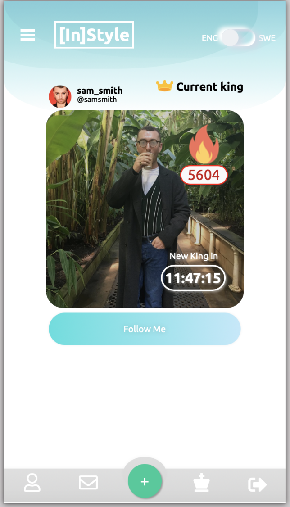
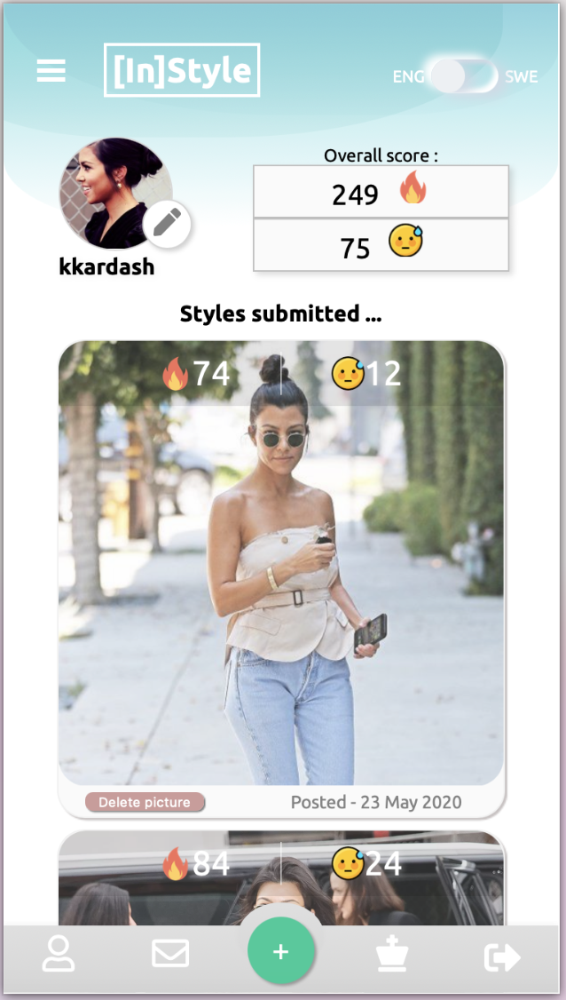
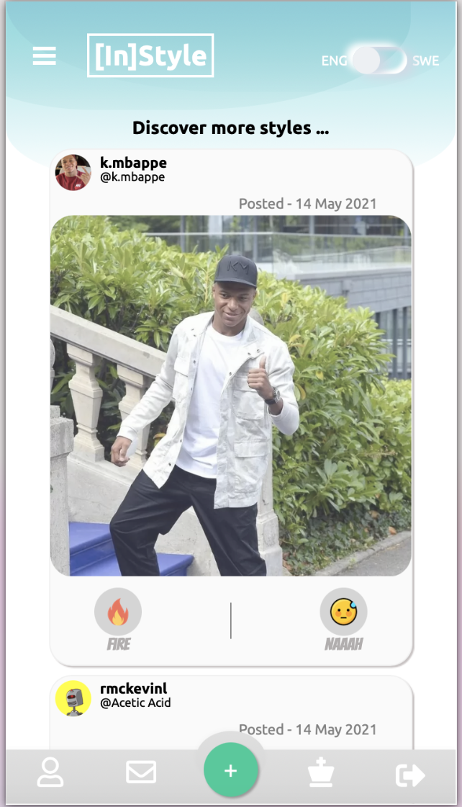
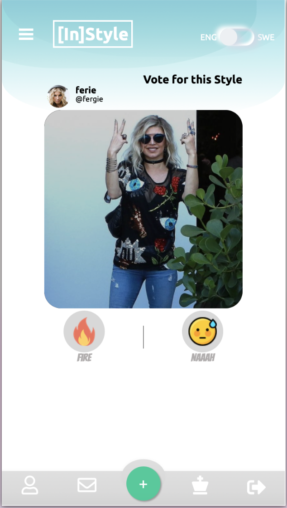

## Introduction
InStyle is a Social Media application for clothing fashion stylists.
The social media era is well and truly underway and photo sharing apps are among the hottest social platform topics. This application is for Style Competition. Every user in this app is a stylist. Every user can have his/her own profile, submit their style pictures, and vote (like) for other user's styles. The user with the most voted style in the day is the winner and is awarded the title of Current King. Everyday there is a Current King. The user can follow the current king. He/She can choose to set the application language to English or Swedish and vice versa. He/She can also comment on styles.

## Video
[Demo video](https://www.youtube.com/watch?v=ebssTUmm5A8)

## Getting Started
The web application is made up of three parts: database(PostgreSQL), backend (Spring Boot) and frontend (React.js).

### Prerequisites
* Docker/Docker Compose
* Java Runtime (tested with version 15)

## Front-end React.JS

The front-end for this application is built with

```
npx create-react-app InStyle
cd frontend
npm install 
```
It runs with

```
npm start 
```
Once the application starts, it can be accessed at http://localhost:3000.

## PostgreSQL database

Connection to the database is made with
```
docker-compose up
```

## Back-end Spring Boot

Spring boot was initialize with

```
gradle init
```

and Groovy was selected as the build script DSL.

It runs with

```
./gradlew bootRun
```

The application can be stopped with

```
Crtl + C
```
## Setup
We need to configure the following dependencies in `build.gradle`:

```Dependencies:
plugins {
    id 'org.springframework.boot' version '2.2.0.RELEASE'
    id 'io.spring.dependency-management' version '1.0.8.RELEASE'
    id 'java'
}

group = 'se.kth.sda'
version = '0.0.1-SNAPSHOT'
sourceCompatibility = '11'

configurations {
    developmentOnly
    runtimeClasspath {
        extendsFrom developmentOnly
    }
}

repositories {
    mavenCentral()
}

dependencies {
    implementation 'org.springframework.boot:spring-boot-starter-data-jpa'
    implementation 'org.springframework.boot:spring-boot-starter-security'
    implementation 'org.springframework.boot:spring-boot-starter-thymeleaf'
    implementation 'org.springframework.boot:spring-boot-starter-web'
    developmentOnly 'org.springframework.boot:spring-boot-devtools'
    compile group: 'com.auth0', name: 'java-jwt', version: '3.8.3'
    implementation group: 'commons-io', name:'commons-io', version:'2.6'
    runtimeOnly 'org.postgresql:postgresql'
}


test {
    useJUnitPlatform()
}
```

`src/main/resources/application.properties` should be configured:
```properties
spring.jpa.database=POSTGRESQL
spring.datasource.platform=postgres
spring.datasource.url=jdbc:postgresql://localhost:5431/skeleton
spring.datasource.username=skeleton_user
spring.datasource.password=skeleton_pass
spring.jpa.show-sql=true
spring.jpa.generate-ddl=true
spring.jpa.hibernate.ddl-auto=create
spring.jpa.properties.hibernate.jdbc.lob.non_contextual_creation=true
spring.servlet.multipart.max-file-size=300MB
spring.servlet.multipart.max-request-size=300MB

spring.jpa.properties.hibernate.dialect= org.hibernate.dialect.PostgreSQLDialect
```
## DataBase PostgreSQL Setup
Dockerized PostgreSQL database:

The docker-compose.yaml is manually created with

```touch docker-compose.yaml
```
and the following specifications added to the file
```docker-compose.yaml
version: "3"
services:
  database:
    image: postgres:13-alpine
    environment:
       - POSTGRES_DB=skeleton 
       - POSTGRES_USER=skeleton_user
       - POSTGRES_PASSWORD=skeleton_pass
    ports:
      - "5431:5432"
    volumes:
      - db-data:/var/lib/postgresql/data

volumes:
  db-data:
```

## Docker Commands

1. Start container
```
docker-compose up
```
2. Stop container
```
docker-compose down
```
3. List all Running Containers
```
docker ps
```
4. Enter the Running Container
```
docker-compose exec database /bin/sh
```
5. Enter the PostgreSQL database
```
psql skeleton skeleton_user
```
6. Connect to the database:
```bash
\c
```
7.Show the tables in the database
```bash
\dt
```
8.Show all rows in particular table such us the "account" table
```
SELECT * FROM account;
```
## Usage

Once the application runs, The user:

1. registers a username and password, and adds an avatar to his/her profile, if he/she has not already done so, otherwise, he/she logs in.
2. chooses, if he/she so wishes, the app's language between English and Swedish and vice versa.
3. can proceed to upload and post pictures showing their styles for the competition.
4. can start voting by clicking either FIRE (like) icon or NAAAH (dislike) on other users' style pictures but only once per picture.
5. can start commenting on others styles or delete comments.
6. can follow the winner or other users.
7. can navigate to other users' pages can comment on styles and also user's can delete the comment.
8. can log out once done.

## List of Front-End Components

| FrontEnd Components |
| ------------|
| `1.Card`    | 
| `2.CardDrawer`    | 
| `3.Comments`    | 
| `4.CountDownComponent`    | 
| `5.EditProfileButton`    | 
| `6.Footer`    | 
| `7.HeaderBackground`    | 
| `8.LandingOverlay`    | 
| `9.Navbar`    | 
| `10.Popup`    | 
| `11.ProfileCard`    | 
| `12.SlidingMenu`    | 
| `13.ToggleLanguage`    | 
| `14.UploadButton`    | 
| `15.UploadForm`    | 
| `16.UploadWidget`    | 
| `17.UserMeta`    | 
| `18.VoteComponent`    | 

### Auth API Endpoints

| HTTP Method | HTTP Path | Action |
| ------------|-----------|--------|
| `POST`    | `/register` | Create new account. |
| `POST`    | `/authenticate` | Authenticate User. |

### User API EndPoints

| HTTP Method | HTTP Path | Action |
| ------------|-----------|--------|
| `PUT`    | `/current-user` | Update current username. |
| `GET`    | `/current-user` | Get the current user. |
| `GET`    |  `/users`     | Get all users. |

### Picture API EndPoints

| HTTP Method | HTTP Path | Action |
| ------------|-----------|--------|
| `Post`    | `/picture-url` | Post a picture to the current user by just providing the url. |
| `Post`    | `/picture` | Post a picture to the current user. |
| `Post`    |  `/picture-url/{userId}`     | Post a picture by userId by just providing url. |
| `Post`    | `/picture/{userId}` | Post a picture by userId |
| `Post`    | `/likes/{pictureId}` | Add a like to a picture. |
| `Post`    |  `/dislikes/{pictureId}`     | add a dislike to a picture |

| HTTP Method | HTTP Path | Action |
| ------------|-----------|--------|
| `GET`    | `/files/{id}` | Get picture by ID. |
| `GET`    | `/files` | Get all pictures. |
| `POST`    |  `/upload`     | Upload a picture. |
| `DELETE` | `/files/{id}` | Delete the picture by ID. |

### Comment API EndPoints

| HTTP Method | HTTP Path | Action |
| ------------|-----------|--------|
| `POST`    | `/picture/{pictureId}/comment` | Add comment to picture by Id. |
| `GET`    | `/comments/{pictureId}` | Get comments of a picture by Id. |
| `GET`    |  `/comments`     | Get all comments. |
| `DELETE` | `/comments/{commentId}` | Delete a comment by his ID. |

## ScreenShots
## Login Page


##  Current King Page



## Profile Page



## Discover Page



## Vote Page




